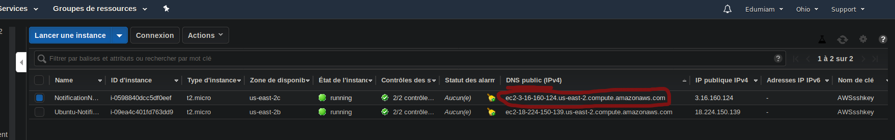

# edumiamServer
A nodejs server to ensure the call from chatfuel and pass the data get from a googleSheets

Un serveur NodeJS s'occupant des appels api venant de chatfuel. Se servant des informations de googleSheets et en mettant à jour Hubspot.

## Comment s'en servir ?

Voici les quelques étapes pour déployer, rebooter (mettre à jour) ou stopper le server

Commençons par le plus courant comment mettre à jour le serveur :

## Reboot (mettre à jour) Sous Linux

#### 1. Se connecter à l'instance AWS
- Installer la clef ssh
Rendez vous sur le drive de l'equipe Edumiam puis aller dans "IT Dev tech". Vous y trouverez le fichier "AWSsskey.dem", téléchargez-le et mettez le à un endroit sur (que vous étes capable de retrouver facilement). 
- Ouvrir un terminal
- Entrer la commande qui suit

      ssh -i /<chemin>/AWSsshkey.pem ubuntu@<DNS-public>
      
< chemin> étant la localisation du fichier téléchargé précédement.

Remplacer DNS-public par le DNS présent sur l'instance AWS. Pour trouver celle ci connectez-vous sur [AWS](https://us-east-2.console.aws.amazon.com).
Une fois connecté trouvez le menu des instances ou cliquez sur ce [lien vous y amenant](https://us-east-2.console.aws.amazon.com/ec2/v2/home?region=us-east-2#Instances:sort=dnsName). 

Vous voyez maintenant votre DNS juste là :

Le nom du serveur est EdumiamServer

par exemple :

      ssh -i ~/clefs/AWSsshkey.pem ubuntu@ec2-3-16-160-124.us-east-2.compute.amazonaws.com

Une confirmation est demandé, tapez "yes" puis Entré.
Si tout est bon vous devez avoir quelque chose comme suit:

      ➜  ~ ssh -i ~/clefs/AWSsshkey.pem ubuntu@ec2-3-16-160-124.us-east-2.compute.amazonaws.com
      Welcome to Ubuntu 18.04.2 LTS (GNU/Linux 4.15.0-1035-aws x86_64)
      
       * Documentation:  https://help.ubuntu.com
       * Management:     https://landscape.canonical.com
       * Support:        https://ubuntu.com/advantage
      
        System information as of Mon May 13 09:39:42 UTC 2019
      
        System load:  0.0               Processes:           88
        Usage of /:   27.3% of 7.69GB   Users logged in:     0
        Memory usage: 15%               IP address for eth0: 172.31.32.71
        Swap usage:   0%
      
       * Ubuntu's Kubernetes 1.14 distributions can bypass Docker and use containerd
         directly, see https://bit.ly/ubuntu-containerd or try it now with
      
           snap install microk8s --classic
      
        Get cloud support with Ubuntu Advantage Cloud Guest:
          http://www.ubuntu.com/business/services/cloud
      
       * Canonical Livepatch is available for installation.
         - Reduce system reboots and improve kernel security. Activate at:
           https://ubuntu.com/livepatch
      
      77 packages can be updated.
      0 updates are security updates.
      
      
      Last login: Mon May 13 08:45:17 2019 from 195.85.247.129
      ubuntu@ip-172-31-32-71:~$ 

Si ça n'est pas le cas assurez vous que l'instance est bien "running", que votre clef ssh est à l'endroit que vous avez indiqué et que votre DNS est correct. Si il n'est toujours pas possible de se connecter à l'instance essayez de la redémarrer. Voir "stopper le serveur" ci-dessous.

#### 2. Trouver le serveur

- Installer screen: 
      
      sudo apt upgrade
      sudo apt install screen

- Se connecter au bon screen

lancez une region screen
    
      screen

listez tout les screen présent

      screen -ls
      
Vous devez avoir une réponse comme ceci :
      
      ubuntu@ip-172-31-32-71:~$ screen -ls
      There are screens on:
              1705.pts-0.ip-172-31-32-71      (05/13/19 09:46:10)     (Attached)
              1509.pts-0.ip-172-31-32-71      (05/13/19 09:44:45)     (Detached)
      2 Sockets in /run/screen/S-ubuntu.
      ubuntu@ip-172-31-32-71:~$ 
      
Attachez-vous à la 2e socket comme suit

      screen -r 1509
      
Vous devez vous trouver sur la socket où le serveur tourne dans ce cas passez à l'étape 3 cela devrait ressembler à quelque chose comme suit:

      ubuntu@ip-172-31-32-71:~/edumiamServer$ npm start
      
      > livredor@1.0.0 start /home/ubuntu/edumiamServer
      > nodemon ./src/routeManager.js
      
      [nodemon] 1.19.0
      [nodemon] to restart at any time, enter `rs`
      [nodemon] watching: *.*
      [nodemon] starting `node ./src/routeManager.js`
      Your app is listening on port 8080

Il se peut que des messages écris par le serveur soit aussi affichés.

Si ça n'est pas le cas il est possible que le serveur soit à l'arrêt, vous pouvez tentez de le lancer pour le vérifier.  
Pour cela aller dans le dossier possédant le serveur
    
      cd edumiamServer
      
et lancez le serveur

      npm start
      
Si la console affiche :

      ubuntu@ip-172-31-32-71:~/edumiamServer$ npm start
      
      > livredor@1.0.0 start /home/ubuntu/edumiamServer
      > nodemon ./src/routeManager.js
      
      [nodemon] 1.19.0
      [nodemon] to restart at any time, enter `rs`
      [nodemon] watching: *.*
      [nodemon] starting `node ./src/routeManager.js`
      events.js:183
            throw er; // Unhandled 'error' event
            ^
      
      Error: listen EADDRINUSE :::8080
          at Object._errnoException (util.js:1022:11)
          at _exceptionWithHostPort (util.js:1044:20)
          at Server.setupListenHandle [as _listen2] (net.js:1367:14)
          at listenInCluster (net.js:1408:12)
          at Server.listen (net.js:1492:7)
          at Function.listen (/home/ubuntu/edumiamServer/node_modules/express/lib/application.js:618:24)
          at Object.<anonymous> (/home/ubuntu/edumiamServer/src/routeManager.js:28:5)
          at Module._compile (module.js:652:30)
          at Object.Module._extensions..js (module.js:663:10)
          at Module.load (module.js:565:32)
          at tryModuleLoad (module.js:505:12)
          at Function.Module._load (module.js:497:3)
          at Function.Module.runMain (module.js:693:10)
          at startup (bootstrap_node.js:188:16)
          at bootstrap_node.js:609:3
      [nodemon] app crashed - waiting for file changes before starting...

cela veut dire que le serveur tourne bel et bien, "ctrl-c" pour arréter votre nouveau serveur. Vous pouvez essayer de vous connecter à d'autres sockets de screen voir le [Wiki](https://doc.ubuntu-fr.org/screen) pour plus d'information. Si vous avez du mal à trouver la socket vous pouvez toujours faire redémarrer le serveur. Voir c-desssous. 

#### 3. Mettre à jour le serveur

- Stoppez le serveur: Un simple "crl-c" devrait suffire.

- Mettre à jour

      git pull
      
Puis entrez vos identifiants github.

- Lancer-le
    
      npm start
      
Votre serveur doit tourner correctement voir au-dessus si une erreur apparait.

- Pour quitter l'instance faites un simple click-droit sur la console et choississez "quitter"
